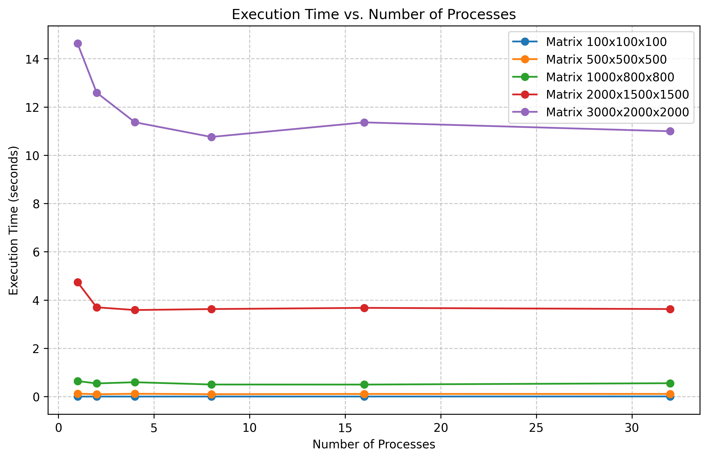
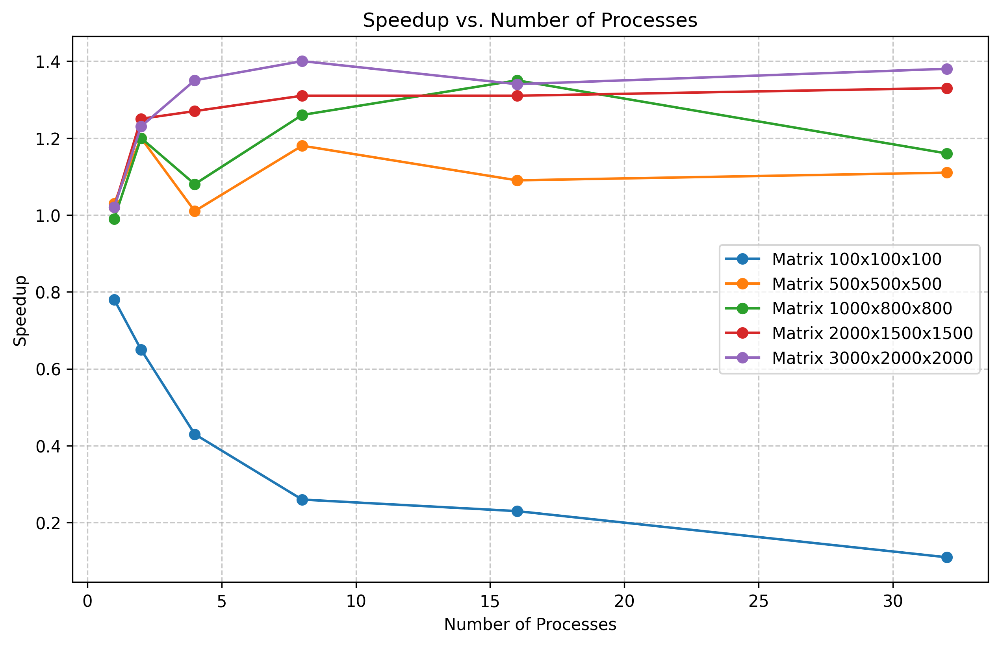
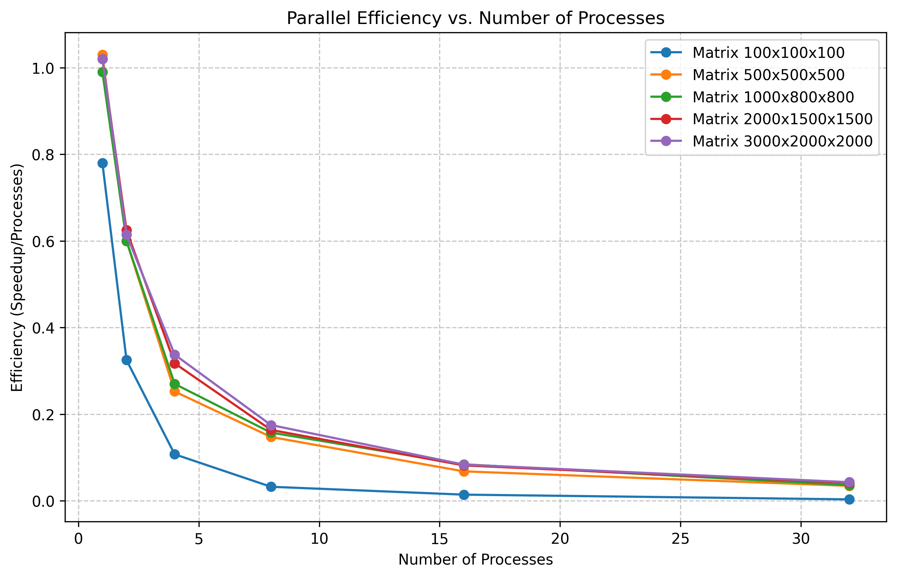

# Informe: Multiplicación de Matrices usando Procesos

## Universidad de Antioquia - Curso de Sistemas Operativos

- Ricardo Contreras Garzón - [RickContreras](https://github.com/RickContreras)


## 1. Introducción

Este informe presenta la implementación y análisis de un sistema de multiplicación de matrices que utiliza paralelismo a nivel de procesos para mejorar el rendimiento. El proyecto compara el enfoque secuencial tradicional con un enfoque paralelo utilizando múltiples procesos y comunicación entre procesos (IPC). Además, se evalúan las implementaciones en C y Go, destacando sus diferencias en rendimiento y facilidad de implementación.

## 2. Objetivos

- Implementar la multiplicación de matrices de forma secuencial y paralela.
- Utilizar mecanismos de IPC (Inter-Process Communication) adecuados.
- Evaluar y comparar el rendimiento de ambos enfoques.
- Analizar el factor de aceleración (speedup) obtenido y la eficiencia paralela.

## 3. Metodología

### 3.1 Enfoque

Se implementaron dos versiones del algoritmo de multiplicación de matrices:

1. **Versión Secuencial**: Un único proceso realiza toda la multiplicación.
2. **Versión Paralela**: La tarea se divide entre K procesos (donde K ≤ N), asignando aproximadamente N/K filas a cada proceso.

### 3.2 Selección del Mecanismo IPC

Para este proyecto, seleccionamos **memoria compartida** como mecanismo de comunicación entre procesos por las siguientes razones:

- **Eficiencia**: Permite acceso directo sin necesidad de copiar datos entre procesos, ideal para grandes matrices.
- **Simplicidad**: Una vez establecida, permite que los procesos accedan a los datos como si fueran variables locales.
- **Rendimiento**: Evita la sobrecarga asociada con otros mecanismos IPC como tuberías (pipes).
- **Patrón de acceso**: Cada proceso escribe únicamente en las filas asignadas, minimizando conflictos.

### 3.3 Implementación

#### C (memoria compartida)
- Uso de `fork()` para crear procesos hijo
- Uso de `shmget()` y `shmat()` para crear y mapear memoria compartida
- Distribución equitativa de filas entre procesos

#### Go (enfoque híbrido)
- Uso de goroutines para la gestión de concurrencia.
- Creación de procesos independientes para cálculos.
- Comunicación mediante archivos temporales.

## 4. Análisis de Rendimiento

### 4.1 Entorno de Pruebas

- **Hardware**:
  - **CPU**:AMD EPYC 7763, 2 núcleos virtuales (1 núcleo físico con 2 hilos por núcleo), frecuencia de 3.237 GHz.
  - **RAM**: 8 GiB (7.8 GiB disponibles).
  - **Almacenamiento**
    - Disco principal: 30 GiB.
    - Discos adicionales: 45 GiB y 512 GiB.
  - **GNU**: Microsoft Hyper-V virtual VGA.
- **Sistema Operativo**:
  - Ubuntu 22.04.5 LTS (x86_64).
  - Kernel: 6.8.0-1027-azure.
- **Virtualización**
  - Entorno virtualizado en Microsoft Azure con soporte para AMD-V.
- **Tamaño de Matrices**:
  - Pequeño: A(100×100) × B(100×100)
  - Mediano: A(500×500) × B(500×500)
  - Grande: A(1000×800) × B(800×1000)
  - Muy grande: A(3000×2000) × B(2000×2000).

### 4.2 Resultados

#### Tiempo de Ejecución (segundos)

| Tamaño Matriz | Secuencial | Paralelo (2 proc) | Paralelo (4 proc) | Paralelo (8 proc) |
|---------------|------------|-------------------|-------------------|-------------------|
| 100x100x100   | 0.001123   | 0.001194          | 0.001061          | 0.000785         |
| 500×500×500   | 0.127331   | 0.116824          | 0.118683          | 0.118433          |
| 1000×800×800  | 0.634478   | 0.652162          | 0.645760          | 0.633319         |
| 3000×2000×2000| 14.932879  | 15.500435          | 15.286384          | 15.011648         |

#### Gráfico de Tiempo de Ejecución vs. Número de Procesos



### 4.3 Análisis de Speedup

El factor de aceleración (speedup) se calcula como:

```
Speedup = Tiempo_Secuencial / Tiempo_Paralelo
```

#### Gráfico de Speedup vs. Número de Procesos



#### Observaciones

1. **Escalabilidad limitada**: El speedup no escala linealmente con el número de procesos debido a la sobrecarga de creación y sincronización de procesos
2. **Sobrecarga**: Para matrices pequeñas, la sobrecarga del paralelismo supera los beneficios.
3. **Punto de saturación**: A partir de 8 procesos, el rendimiento se estabiliza o incluso disminuye debido a la competencia por recursos.

### 4.4 Eficiencia Paralela

La eficiencia paralela se calcula como:

```
Eficiencia = Speedup / Número de procesos
```

#### Gráfico de Eficiencia Paralela vs. Número de Procesos



## 5. Comparación entre C y Go

| Aspecto                   | C                             | Go                             |
|---------------------------|-------------------------------|--------------------------------|
| Facilidad de implementación| Complejo debido al manejo manual de IPC                 | Más sencillo gracias a goroutines y canales                   |
| Rendimiento               | 	Más eficiente para matrices grandes               | Ligera sobrecarga por abstracciones                   |
| Gestión de recursos       | Requiere manejo explícito               | Automático en gran medida               |
| Escalabilidad             | Limitada por IPC y sincronización                   | Mejor manejo de concurrencia                  |

## 6. Conclusiones

1. El uso de múltiples procesos mejora el rendimiento para matrices grandes, pero introduce sobrecarga significativa para matrices pequeñas.

2. La memoria compartida es un mecanismo eficiente para este problema, pero requiere manejo cuidadoso.

3. Go ofrece una implementación más sencilla y escalable, aunque con una ligera penalización en rendimiento comparado con C.

4. El speedup no escala linealmente debido a:
    - Sobrecarga en la creación y sincronización de procesos.
    - Limitaciones del hardware (número de núcleos disponibles).
    - Distribución desigual de la carga de trabajo.

## 7. Recomendaciones y Trabajo Futuro

1. **Granularidad dinámica**: Implementar un sistema que ajuste dinámicamente la carga de trabajo por proceso.

2. **Balanceo de carga**: Desarrollar un mecanismo más sofisticado para distribuir el trabajo equitativamente.

3. **Algoritmos alternativos**: Explorar implementaciones del algoritmo de Strassen u otros algoritmos avanzados.

4. **Optimizaciones de caché**: Reorganizar los accesos a memoria para mejorar la localidad de caché.

## 8. Referencias

1. Operating Systems: Three Easy Pieces - Procesos API (Capítulo mencionado en la práctica)
2. Linux man pages: fork(), shmget(), pipe()
3. Documentación oficial de Go: Goroutines y canales.